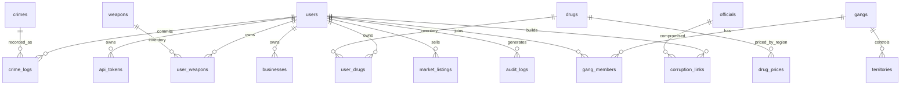

# ER Diagram

```mermaid
erDiagram
    users ||--o{ api_tokens : owns
    users ||--o{ crime_logs : commits
    crimes ||--o{ crime_logs : recorded_as
    users ||--o{ user_weapons : owns
    weapons ||--o{ user_weapons : inventory
    users ||--o{ user_drugs : owns
    drugs ||--o{ user_drugs : inventory
    drugs ||--o{ drug_prices : priced_by_region
    users ||--o{ businesses : owns
    gangs ||--o{ gang_members : has
    users ||--o{ gang_members : joins
    gangs ||--o{ territories : controls
    users ||--o{ corruption_links : builds
    officials ||--o{ corruption_links : compromised
    users ||--o{ market_listings : sells
    users ||--o{ audit_logs : generates
```
